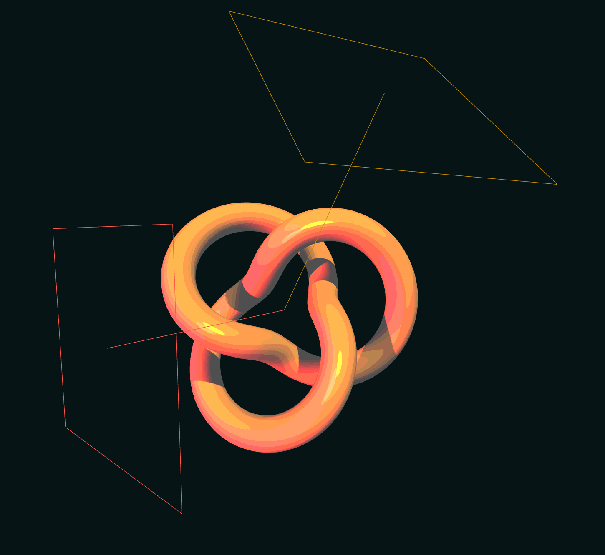

# Cell-Shade-Material

**✏️ NOTE: This is still being worked on (right now you can grab the shader code in `components/canvas/shaders/cellshade-material/` and use it how you like). I'll get around to making it an actual extendable material 😶‍🌫️**

A custom cell-shading material for [THREE.js](https://threejs.org/). A bit more fun than three's toon material!

## Demo

## Features (in progress...)

⬛ Supports all lights

⬛ Shadows

⬛ Controllable shading paramaters

 

